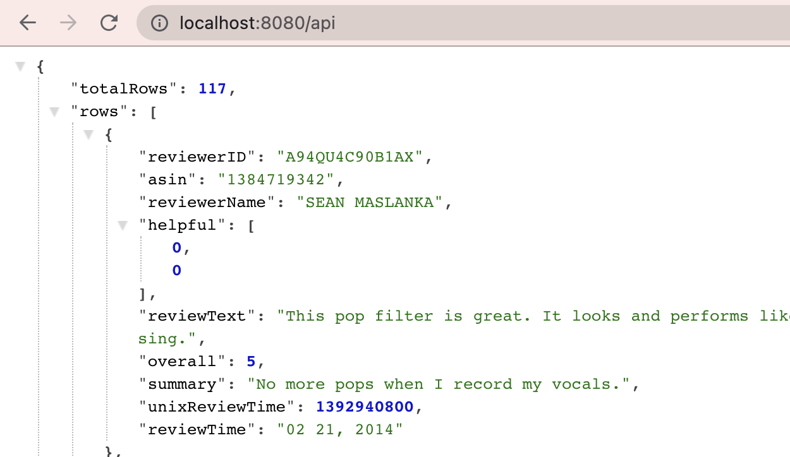

A server app built using [Shelf](https://pub.dev/packages/shelf),
configured to enable running with [Docker](https://www.docker.com/).

This sample code handles HTTP GET requests to `/api` and returns a JSON response from a local file.

# Running the sample

## Running with the Dart SDK

You can run the example with the [Dart SDK](https://dart.dev/get-dart)
like this:

```
$ dart run bin/server.dart
Server listening on port 8080
```

And then from a second terminal:
```
$ curl http://0.0.0.0:8080
Hello World !
$ curl http://0.0.0.0:8080/echo/I_love_Dart
I_love_Dart

$ curl http://0.0.0.0:8080/api
<get API response>
```

## Running with Docker

If you have [Docker Desktop](https://www.docker.com/get-started) installed, you
can build and run with the `docker` command:

```
$ docker build . -t myserver
$ docker run -it -p 8080:8080 myserver
Server listening on port 8080
```

And then from a second terminal:
```
$ curl http://0.0.0.0:8080
Hello, World!
$ curl http://0.0.0.0:8080/echo/I_love_Dart
I_love_Dart
```

You should see the logging printed in the first terminal:
```
2021-05-06T15:47:04.620417  0:00:00.000158 GET     [200] /
2021-05-06T15:47:08.392928  0:00:00.001216 GET     [200] /echo/I_love_Dart
```

## So how does it work ?

The dart code reads data from the json file located inside the `bin` folder, and sends the same as the server response.

Note: Only GET works for the API. ie, if you are testing the API on any API Testing Tools like Postman using any HTTP methods other than GET, you may receive the default response only.

## Query Parameters

<table>
    <tr>
        <th> Parameter </th>
        <th> What does it do? </th>
    </tr>
    <tr>
        <td> offset </td>
        <td> The amount of data entries that should be skipped </td>
    </tr>
    <tr>
        <td> pageSize </td>
        <td> Total amount of entries to be shown </td>
    </tr>
</table>

